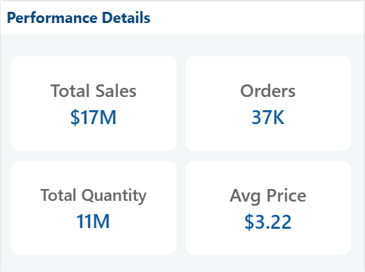

# 🛒 Retail Sales Data Warehouse & Power BI Analytics Dashboard

An end-to-end data analytics project that transforms raw retail transaction data into a clean data warehouse and an interactive Power BI dashboard for business insights.

---

## 📌 Project Overview

This project demonstrates a complete **data engineering + business intelligence workflow**:

- Raw CSV retail data ingestion (2009–2011)
- Data cleaning & normalization using SQL (PostgreSQL)
- Star schema data modeling
- Analytical data mart creation
- Power BI dashboard design with advanced UX features:
  - KPI cards
  - Sales trends
  - Product performance
  - Customer analysis
  - Quantity buckets
  - Tooltips
  - Conditional formatting
  - Professional layout & color theme

🔍SQL querires? Check them out here: [project_sql folder](/SQL)

## 🏗 Architecture

CSV Files -> Staging Schema (raw text) -> Cleaning & Validation (SQL) -> Star Schema (Dimensions + Fact) -> Data Mart -> Power BI Dashboard

---

## 🧪 Data Processing Steps

### 1️⃣ Staging Layer

- All columns stored as `TEXT`
- Handles mixed formats (dates, invoice numbers, stock codes)

### 2️⃣ Data Profiling

- Null detection
- Invalid values
- Date format inconsistencies
- Duplicate records
- Negative quantities & prices

### 3️⃣ Cleaning & Normalization

- Date normalization (`DD/MM/YYYY` & `MM/DD/YYYY`)
- Type casting
- Trimming text fields
- Removing invalid records
- Handling duplicated yearly loads

### 4️⃣ Business Rules Applied

| Rule                   | Description               |
| ---------------------- | ------------------------- |
| Quantity > 0           | Remove returns            |
| Unit Price > 0         | Remove free/invalid items |
| Customer ID not null   | Required                  |
| Invoice format valid   | Enforced                  |
| Remove full duplicates | Multi-column distinct     |

### 5️⃣ Star Schema Design

**Fact Table**

- `fact_sales`

**Dimensions**

- `dim_customers`
- `dim_products`
- `dim_date`
- `dim_country`

---

## 📊 Power BI Dashboard Pages

[View full interactive dashboard here on Power BI Service](https://app.powerbi.com/groups/me/reports/1ef669ad-9df6-404d-a266-403287d96f99/f940b01030c6e20b10d3?experience=power-bi)

### 1. Executive Overview

- Total Sales
- Orders
- Customers
- Products
- Sales trend
- Country performance


### 2. Product & Customer Analysis

- Top products
- Sales vs Quantity buckets
- Product table (Top 10 + conditional formatting)
- Orders per customer histogram
- Top customers
- Revenue distribution


### 3. Tooltip Page (Advanced)

Custom tooltip showing:

- Orders
- Total Quantity
- Average Price
- Total Sales



## 🧮 Key `DAX` Measures

```DAX
Total Sales = SUM(fact_sales[total_sales])

Total Orders = DISTINCTCOUNT(fact_sales[invoice_no])

Total Customers = DISTINCTCOUNT(dim_customers[customer_id])

Avg Price = DIVIDE([Total Sales], SUM(fact_sales[total_quantity]))

```

**Quantity Bucket Column**

```DAX
Quantity Bucket =
SWITCH(
	TRUE(),
	fact_sales[total_quantity] <= 5, "1–5",
	fact_sales[total_quantity] <= 10, "6–10",
	fact_sales[total_quantity] <= 20, "11–20",
	fact_sales[total_quantity] <= 50, "21–50",
	"50+"
)
```

---

## 🛠 Tools Used

| Tool        | Purpose         |
| ----------- | --------------- |
| PostgreSQL  | Data warehouse  |
| pgAdmin     | SQL development |
| Power BI    | Visualization   |
| Power Query | Data modeling   |
| GitHub      | Version control |

---

## 🚀 How to Run

1. Create database
2. Run [SQL](/SQL) files in order : 00 → 05

---

📈 Future Improvements

- Incremental loading
- Slowly Changing Dimensions (SCD2)
- Automated pipelines (Airflow)
- Row-level security
- Forecasting models
- Deployment to Power BI Service

---

## 👤 Author

### ALSIDDIG AMASAIB

**_Alsiddig Amasaib_**  
Data Analyst | SQL • PostgreSQL • Excel • Python • Power BI

🌍 Nationality: Sudan  
📍 Current Address: Saudi Arabia, Riyadh  
🔗 GitHub: https://github.com/AL-SIDDIG  
🔗 LinkedIn: https://www.linkedin.com/in/al-siddig-amasaib-668a66117

_This project is part of my data analytics portfolio and demonstrates my ability to use SQL & Power BI b to solve real-world business problems and extract actionable insights from relational databases._
